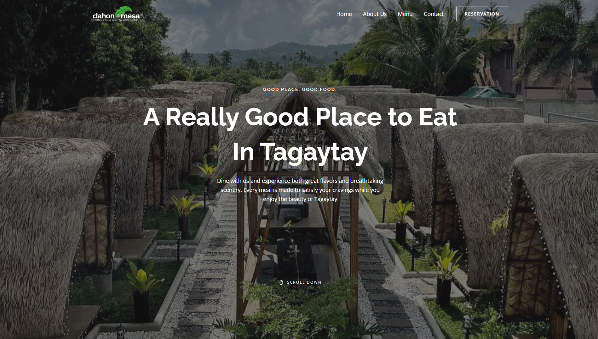
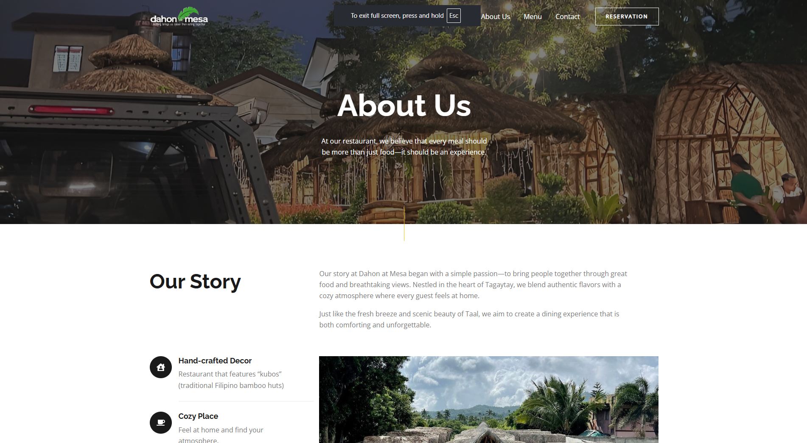
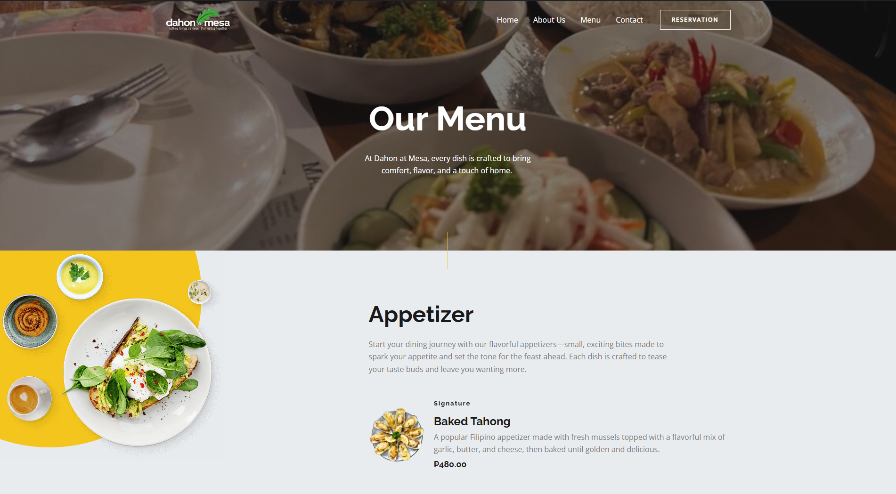
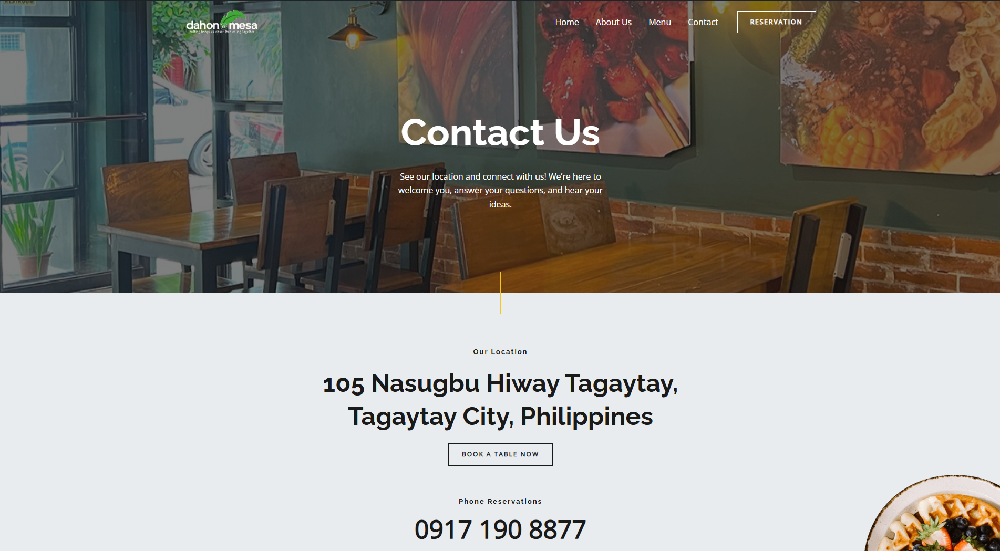

# 💻 Dahon at Mesa Website
The Dahon at Mesa website highlights the restaurant ambiance, menu, story, and location for an easy and inviting visit.

## 📍 Navigation
- 🏠 Home page
- ℹ️ About Us
- 🍽️ Menu
- ☎️ Contact
  
---

# Home Page
The homepage of Dahon at Mesa showcases the cozy atmosphere, featured menu items, a photo gallery, introductions to the team, and customer testimonials, providing visitors with an engaging and comprehensive overview of the restaurant.

---

# About Us
The About page of Daho at Mesa shares the story behind the restaurant, highlights its signature specialties, and invites visitors to discover the unique ambiance that makes every dining experience memorable.

---

# Menu
he Menu page of Dahon at Mesa showcases a carefully curated selection of dishes, including appetizers, main courses, and desserts, allowing visitors to explore flavors and plan their perfect meal.

---

# Contact
The Contact page of Dahon at Mesa provides all the details visitors need to get in touch, including the restaurant’s location, phone number, social medias, and a convenient contact form for inquiries or reservations.”

---

## 🛠️ Technologies Used
- **IDE**: WordPress
- **Theme**: Astra
- **Plugins**: Elemnetor, Spectra, Starter Templates, WPForms

---
